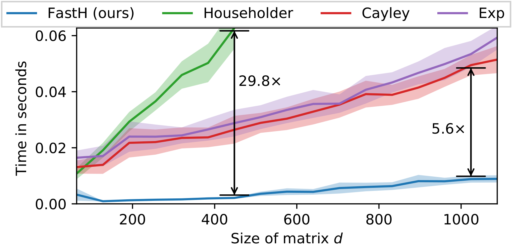

# FastH
Code accompanying article <a href="https://arxiv.org/abs/2009.13977" target="_blank">What if Neural Networks had SVDs?</a> accepted for spotlight presentation at NeurIPS 2020. 

<p align="center">

</p>

**UPDATE:** We currently recommend using the newer fasth++ algorithm from <a href="https://github.com/AlexanderMath/fasth/blob/master/fasthpp.py" target="_blank">fasthpp.py</a> which only uses PyTorch (no need to compile CUDA code)!

If, for some reason, you want to use our CUDA code, please see this <a href="https://colab.research.google.com/drive/1cEj2tSuAYGtG222bieKH4AZ_omIjAAvl?usp=sharing" target="_blank">Google Colab</a>. 


# Requirements 
First, check out how to run the code in <a href="https://colab.research.google.com/drive/1cEj2tSuAYGtG222bieKH4AZ_omIjAAvl?usp=sharing" target="_blank">Google Colab</a>. 

To install locally, run 
```
pip install -r requirements.txt
```
Check installation by running test cases. 
```
python test_case.py
```

See <a target="_blank" href="test_case.py">test_case.py</a> for expected output.


# Minimal Working Example 
```
import torch
from fasth_wrapper import Orthogonal 

class LinearSVD(torch.nn.Module): 
	def __init__(self, d, m=32): 
		super(LinearSVD, self).__init__()
		self.d		  = d

		self.U = Orthogonal(d, m)
		self.D = torch.empty(d, 1).uniform_(0.99, 1.01)
		self.V = Orthogonal(d, m)

	def forward(self, X):
		X = self.U(X)
		X = self.D * X 
		X = self.V(X)
		return X 

bs = 32
d  = 512
neuralSVD = LinearSVD(d=d)
neuralSVD.forward(torch.zeros(d, bs).normal_())
```

# Bibtex
If you use this code, please cite 
```
@inproceedings{fasth,
    title={What If Neural Networks had SVDs?,
    author={Mathiasen, Alexander and Hvilsh{\o}j, Frederik and J{\o}rgensen, Jakob R{\o}dsgaard and Nasery, Anshul and Mottin, Davide},
    booktitle={NeurIPS},
    year={2020}
}
```
A previous version of the <a href="https://invertibleworkshop.github.io/accepted_papers/pdfs/10.pdf" target="_blank">article</a> was presented at the ICML workshop on <a target="_blank" href="https://invertibleworkshop.github.io/">Invertible Neural Networks and Normalizing Flows</a>. This does not constitute a dual submission because the workshop does not qualify as an archival peer reviewed venue.
