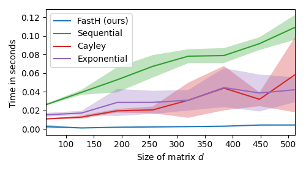

# Reproduce Figure 3 
To reproduce a small version of Figure 3 just run ```figure3.py``` (see below). The full experiment takes a few hours and can be run by changing a few lines in ```figure3.py```. 

<p align="center">

</p>


